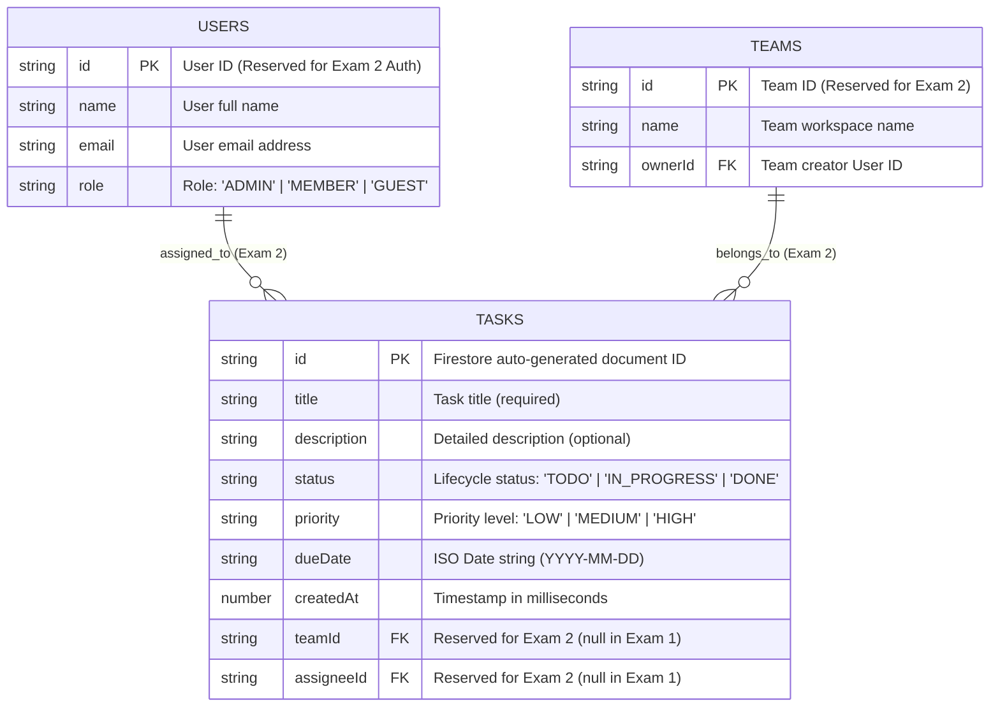

# TaskFlow – Mobile Task Management Application (React Native & Firebase Firestore)

[](https://github.com/DinhLoii/assignment-mma301/actions/workflows/ci.yml)
[](https://expo.dev/)
[](https://reactnative.dev/)
[](https://firebase.google.com/)
[](https://github.com/pmndrs/zustand)
[](https://www.typescriptlang.org/)

Technical foundation for **Practical Exam 1: Task Management App (MMA301)** built with **React Native (Expo SDK 57)** and **Firebase Cloud Firestore**.

---

## 📌 Repository & Remote
- **GitHub Repository**: [https://github.com/DinhLoii/assignment-mma301](https://github.com/DinhLoii/assignment-mma301)
- **Git Remote Origin**: `git@github.com:DinhLoii/assignment-mma301.git`

---

## 🚀 Key Features

### 1. Public Real-time Task CRUD (No Authentication Required)
- **Real-time Synchronization**: Listens directly to Cloud Firestore collection updates using `onSnapshot`. Any change in Firebase Console or from other devices reflects immediately without manual refresh.
- **Create Task**: Modal form with client-side validation (title required, minimum length check, input trimming).
- **Read / List Tasks**: Clean, responsive layout for both phone and tablet emulators with quick-toggle status action.
- **Update Task**: Pre-filled modal to edit title, description, status, priority, and due date.
- **Delete Task**: Native confirmation alert dialog before deleting document from Firestore.

### 2. Bonus & Production-Grade Features
- **Client-Side Validation**: Instant feedback with visual error messages on empty or invalid inputs.
- **Status Filtering**: Filter by `All`, `To Do`, `In Progress`, and `Done` with real-time counters.
- **Keyword Search**: Instant search by task title or description.
- **Pull-To-Refresh**: Native `RefreshControl` support on task list.
- **Summary Metrics (`TaskStats`)**: Dashboard card displaying progress percentage, completion bar, and status breakdowns.
- **Data Seeder (`demo.tsx`)**: One-click button to seed 4 realistic sample tasks into Firestore for instant grading screenshots.
- **Continuous Integration (CI)**: Automated GitHub Actions pipeline verifying ESLint 9 and TypeScript compilation on push/PR.

---

## 🗄️ Firestore Data Model (ERD)

The application stores tasks in a top-level `tasks` collection in Cloud Firestore. Below is the Entity-Relationship Diagram (ERD) detailing the schema for Exam 1 and future extensions for Exam 2:



### Document Field Specifications

| Field | Type | Required | Description |
| :--- | :--- | :---: | :--- |
| `id` | `string` | Yes | Firestore auto-generated document ID |
| `title` | `string` | Yes | Name of the task |
| `description` | `string` | No | Additional notes, context or acceptance criteria |
| `status` | `string` | Yes | `'TODO'`, `'IN_PROGRESS'`, or `'DONE'` |
| `priority` | `string` | Yes | `'LOW'`, `'MEDIUM'`, or `'HIGH'` |
| `dueDate` | `string` \| `null` | No | Target completion date formatted as `YYYY-MM-DD` |
| `createdAt` | `number` \| `Timestamp` | Yes | Timestamp of document creation |
| `teamId` | `string` \| `null` | No | Team ID (reserved for Exam 2, empty/null for Exam 1) |
| `assigneeId` | `string` \| `null` | No | User ID (reserved for Exam 2, empty/null for Exam 1) |

---

## 🏗️ Architecture & Project Structure

The project strictly follows clean layered architecture and feature-based modularity:

```
assignments/
├── .github/
│   └── workflows/
│       └── ci.yml                        # GitHub Actions CI pipeline
├── .env.example                          # Firebase credentials template
├── .prettierrc                           # Prettier formatting rules
├── eslint.config.js                      # ESLint 9 flat configuration
├── README.md                             # Documentation & ERD
├── REPORT_TEMPLATE.md                    # Guide to prepare StudentID_Exam1.docx
├── package.json
└── src/
    ├── api/                              # Data Access Layer
    │   ├── firebase.ts                   # Firebase App & Cloud Firestore setup
    │   ├── firebaseConfig.example.ts     # Example configuration
    │   ├── taskApi.ts                    # Firestore CRUD & onSnapshot subscription
    │   └── axiosClient.ts                # REST client utility
    ├── models/                           # Domain Layer
    │   ├── Task.ts                       # Task interfaces, statuses, DTOs
    │   └── User.ts                       # User profile model
    ├── store/                            # State Layer (Zustand)
    │   ├── useTaskStore.ts               # Reactive state, actions, filters
    │   └── useAuthStore.ts               # Guest/public state
    ├── theme/                            # Design System
    │   ├── colors.ts                     # Semantic color tokens (light & dark)
    │   └── typography.ts                 # Font sizes, line heights, weights
    ├── utils/                            # Helper Utilities
    │   └── formatters.ts                 # Date formatting, validators, badges
    ├── components/
    │   ├── common/                       # Atomic Reusable Components
    │   │   ├── Button.tsx                # Multi-variant button
    │   │   └── Input.tsx                 # Form text input with validation
    │   ├── ui/                           # Shared UI Elements
    │   │   ├── TaskCard.tsx              # Interactive task card
    │   │   ├── StatusBadge.tsx           # Status badge
    │   │   ├── PriorityChip.tsx          # Priority chip
    │   │   └── EmptyState.tsx            # Empty state illustration
    │   └── tasks/                        # Feature Components
    │       ├── TaskFormModal.tsx         # Create / Edit modal with validation
    │       ├── TaskFilterBar.tsx         # Search bar and status tabs
    │       └── TaskStats.tsx             # Dashboard metric overview
    ├── hooks/                            # Custom React Hooks
    │   ├── useTasks.ts                   # Task hook connecting store & listener
    │   └── useFetchData.ts               # Generic fetch hook
    └── app/                              # Expo Router
        ├── _layout.tsx                   # Root ThemeProvider & Stack
        ├── index.tsx                     # Entry redirect
        ├── (auth)/
        │   └── login.tsx                 # Public/Guest entry screen
        └── (main)/
            ├── _layout.tsx               # Bottom Tab Navigator
            ├── home.tsx                  # Home Screen (Task CRUD)
            ├── teams.tsx                 # "Coming soon" Teams placeholder
            ├── profile.tsx               # "Coming soon" Profile placeholder
            └── demo.tsx                  # Diagnostics & Sample Seeder
```

---

## 🛠️ Getting Started

### 1. Prerequisites
- Node.js (v18 or higher, v20 recommended)
- npm or yarn
- Expo Go app on mobile device OR Android / iOS Emulator

### 2. Installation
```bash
cd assignments
npm install
```

### 3. Firebase Configuration
Create a `.env` file in the root directory (based on `.env.example`):
```env
EXPO_PUBLIC_FIREBASE_API_KEY=AIzaSy...
EXPO_PUBLIC_FIREBASE_AUTH_DOMAIN=your_project_id.firebaseapp.com
EXPO_PUBLIC_FIREBASE_PROJECT_ID=your_project_id
EXPO_PUBLIC_FIREBASE_STORAGE_BUCKET=your_project_id.firebasestorage.app
EXPO_PUBLIC_FIREBASE_MESSAGING_SENDER_ID=123456789012
EXPO_PUBLIC_FIREBASE_APP_ID=1:123456789012:web:abcdef
```

> **Note**: Even if `.env` is not set yet, the app includes an intelligent **In-Memory Fallback Mode** so it can run immediately without crashing! Once real keys are provided in `.env`, it automatically switches to live Cloud Firestore.

### 4. Running the App
```bash
# Start development server
npm start

# Run on Android Emulator / Device
npm run android

# Run in Web Browser
npm run web
```

### 5. Running Tests & Quality Checks
```bash
# Lint code
npm run lint

# Check TypeScript types
npm run type-check

# Format code with Prettier
npm run format
```

---

## 📄 Submission Report
For the written report deliverable required by the course (`StudentID_Exam1.docx`), please refer to [REPORT_TEMPLATE.md](./REPORT_TEMPLATE.md) for the exact captions and screenshot placeholders.
